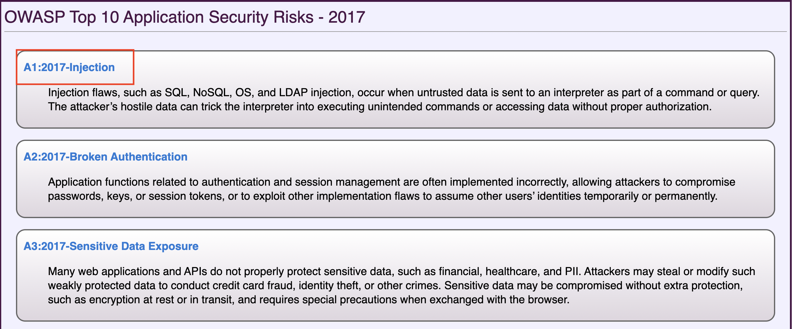

# pg_escape_string
`pg_escape_string()` ใช้หลีกเลี่ยงสตริง(ทุกตัวแปร) ผ่านการป้อนค่าเข้ามาของผู้ใช้ ฟังก์ชันนี้ใช้สำหรับจัดการฐานข้อมูล PostgreSQL หากใช้ MySQL จะใช้ฟังก์ชัน `mysql_escape_string()` แทน ซึ่งฟังก์ชันเหล่านี้สามารถป้องกัน SQL injection attack ได้

## SQL injection คืออะไร?
การโจมตีระบบฐานข้อมูลของเว็บแอปพลิเคชั่น โดยอาศัยช่องโหว่ของการใส่ข้อมูล Input form ของผู้ใช้ยิงคำสั่ง SQL เข้าไป เพื่อให้สามารถเข้าถึงฐานข้อมูลหรือถึงระบบของเว็บแอพพลิเคชั่นได้   
จากข้อมูลของ [OWASP](https://owasp.org/www-project-top-ten/2017/) OWASP Top 10 Application Security Risks - 2017 จะเห็นได้ว่า SQL injection attacks เป็นช่องโหว่หรือภัยคุกคามต่อความปลอดภัยที่เหล่าผู้ไม่ประสงค์ดี (Hacker) ใช้ในการโจมตีฐานข้อมูลและเว็บแอปพลิเคชันที่เกิดขึ้นบ่อยอันดับ 1 และอันตรายมากที่สุด



ตัวอย่างการทำ SQL injection


### รูปแบบการใช้งาน

```php 
pg_escape_string ( resource $connection = ? , string $data ) : string
```

### Parameters 

- connection
- data

### การคืนค่า

`pg_escape_string()` 

### ตัวอย่างการใช้ `pg_escape_string()`

### ตัวอย่าง

```php 
<?php 
  // Connect to the database
  $dbconn = pg_connect('dbname=foo');
  
  // Read in a text file (containing apostrophes and backslashes)
  $data = file_get_contents('letter.txt');
  
  // Escape the text data
  $escaped = pg_escape_string($data);
  
  // Insert it into the database
  pg_query("INSERT INTO correspondence (name, data) VALUES ('My letter', '{$escaped}')");
?>
```

#### Reference
- https://www.php.net/pg_escape_string
- https://alexwebdevelop.com/sql-injection/
